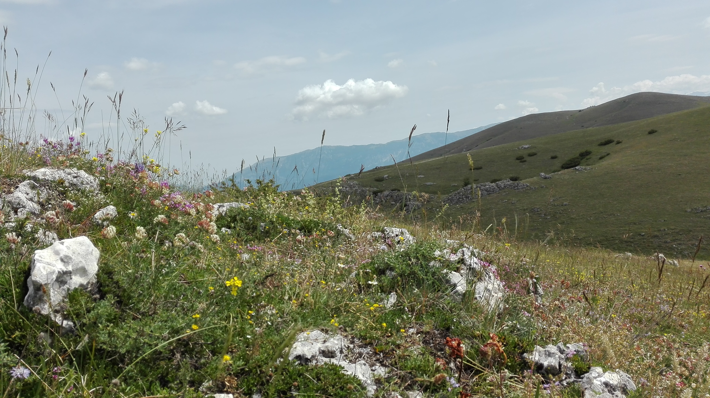
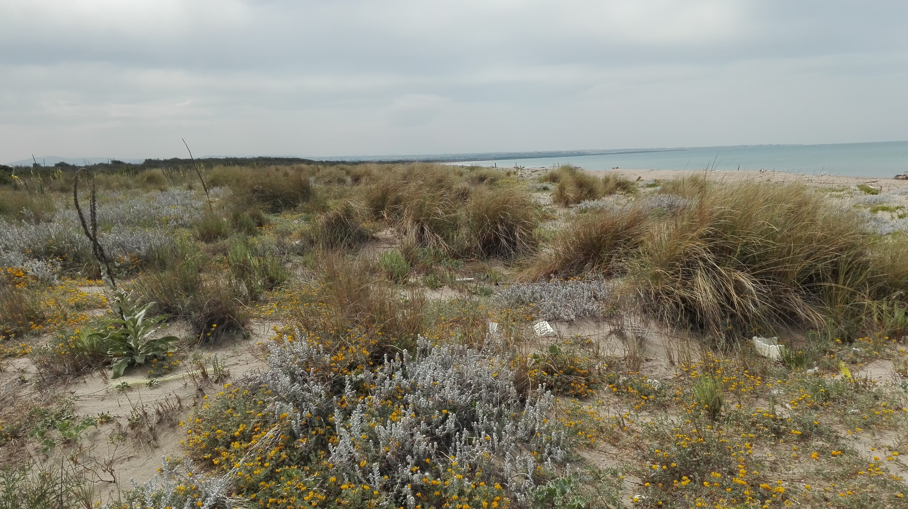

In 2015, I obtained a Ms.C in "Forest conservation and restoration" from [Tuscia University](http://www.unitus.it/en/dipartimento/dafne), with a thesis exploring the ecology and distribution of the fascinating *Acer cappadocicum* subsp. *lobelii* in Italy.
, Abruzzo, Italy")

Between 2015 and 2016, I volunteered in a research project focused on fine-scale biodiversity patters in the [Abruzzo Lazio and Molise National Park](http://www.parcoabruzzo.it/Eindex.php). This allowed me to discover the beauty of semi-natural dry grasslands, and led to some nice collaborations, including [Cancellieri et al. 2017](https://doi.org/10.1080/11263504.2017.1311963) and [Filibeck et al. 2019a](https://doi.org/10.1007/s10531-019-01788-7),[b](https://doi.org/10.1080/11263504.2019.165178).

In 2016, I joined Prof. [Alicia Acosta](https://scholar.google.cz/citations?hl=en&user=mquEQS0AAAAJ)'s lab at Roma Tre University, and I came across what would turn into the main focus of my research: temporal vegetation patterns. For my thesis, I used different approaches to provide an assessment of recent (10-15 years) changes in Mediterranean coastal dune habitats. After performing a diachronic analysis of the [RanvegDunes](http://doi.org/10.1127/phyto/2017/0198) database ([Sperandii et al. 2018](https://doi.org/10.1007/s10531-017-1454-1)), I carried on a resurveying study focused on herbaceous dune habitats. While a [preliminary analysis](https://doi.org/10.1016/j.ecolind.2018.09.039) performed after the first resurvey season was already hinting at important changes in species composition, [the complete assessment of >330 vegetation plots](https://doi.org/10.1111/1365-2745.13547) revealed significant habitat loss as well as dramatic taxonomic and functional shifts, coupled with a sharp decline in *Ammophila arenaria*, probably the most important dune building species in the Mediterranean. Our work was pitched by a Project Editor of “Science and Environmental Policy” (a news service published by the European Commission – DG Environment): [here is the piece based on it](SFEP_article.pdf).   

After obtaining my PhD (2020), I landed in 🇪🇸Valencia🇪🇸, where I joined the [Functional Diversity lab](https://functionaldiversitylab.com) at the [Desertification Research Centre](https://www.uv.es/uvweb/desertification-research-centre/en/desertification-research-centre-1285894590702.html) for a two-years postdoc. There, I worked on the analysis of the mechanisms regulating temporal stability in plant and arthropod communities, with a particular focus on the role of functional traits. Besides, I took part to the [Red Bioclima](https://agroambient.gva.es/es/web/cief/xarxa-bioclima-seguiment-de-la-biodiversitat) project, participating to the vegetation sampling of a network of permanent plots located in natural parks of the Valencian Region.

Since October 2022, I am an ERA Postdoctoral Fellow in the [Vegetation Science Group](https://botzool.cz/vegsci/) at Masaryk University. With my EU-funded project [*VegTrends*](https://mgsperandii.netlify.app/vegtrends/), supervised by Prof. [Milan Chytrý](https://scholar.google.com/citations?hl=en&user=scnnn1UAAAAJ), I will make use of the recently-assembled ResurveyEurope database to produce the first comprehensive and representative report of temporal trends in the vegetation of European open habitats.
