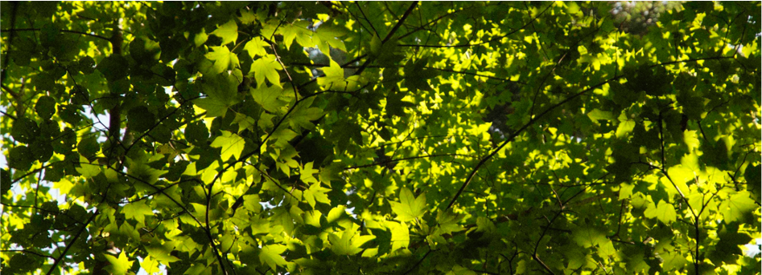

I hold a Ms.C in "Forest conservation and restoration", which I obtained from [Tuscia University](http://www.unitus.it/en/dipartimento/dafne) with a thesis exploring the ecology and distribution of the fascinating *Acer cappadocicum* subsp. *lobelii* in Italy.

*Canopy dominated by Acer cappadocicum subsp. lobelli, Abetina di Rosello, Abruzzo, Italy*

It was about that period, however, that I also had the opportunity to join a research project focused on fine-scale biodiversity patters in the [Abruzzo Lazio and Molise National Park](http://www.parcoabruzzo.it/Eindex.php). This allowed me to discover the beauty of semi-natural dry grasslands, and led to some nice collaborations, including [Cancellieri et al. 2017](https://doi.org/10.1080/11263504.2017.1311963) and [Filibeck et al. 2019a](https://doi.org/10.1007/s10531-019-01788-7),[b](https://doi.org/10.1080/11263504.2019.165178).

During my PhD years, I came in contact with what would turn into the main focus of my research: temporal vegetation patterns. For my thesis, I used different approaches to provide an assessment of recent (10-15 years) changes in Mediterranean coastal dune habitats. After performing a diachronic analysis of the [RanvegDunes](http://doi.org/10.1127/phyto/2017/0198) database [Sperandii et al. 2018](https://doi.org/10.1007/s10531-017-1454-1), I carried on a resurveying study on focused on herbaceous dune habitats. While a [preliminary analysis](https://doi.org/10.1016/j.ecolind.2018.09.039) performed after the first resurvey season was already hinting at important changes in species composition, the complete assessment of >330 plots revealed significant habitat loss, dramatic taxonomic and functional changes, coupled with the a sharp decline in the most important dune building species, Ammophila arenaria  

After obtaining my PhD at Roma Tre University, I landed in 🇪🇸Valencia🇪🇸, where I joined for two years the Functional Diversity Lab at the Desertification Research Centre (institute of the Spanish National Research Council).
