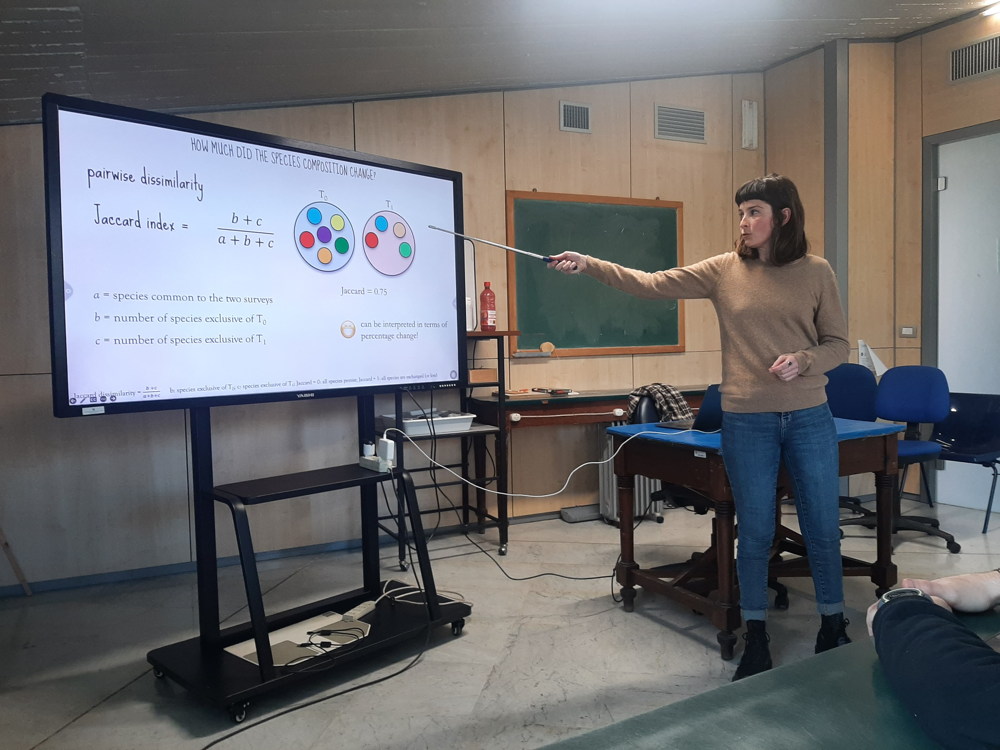
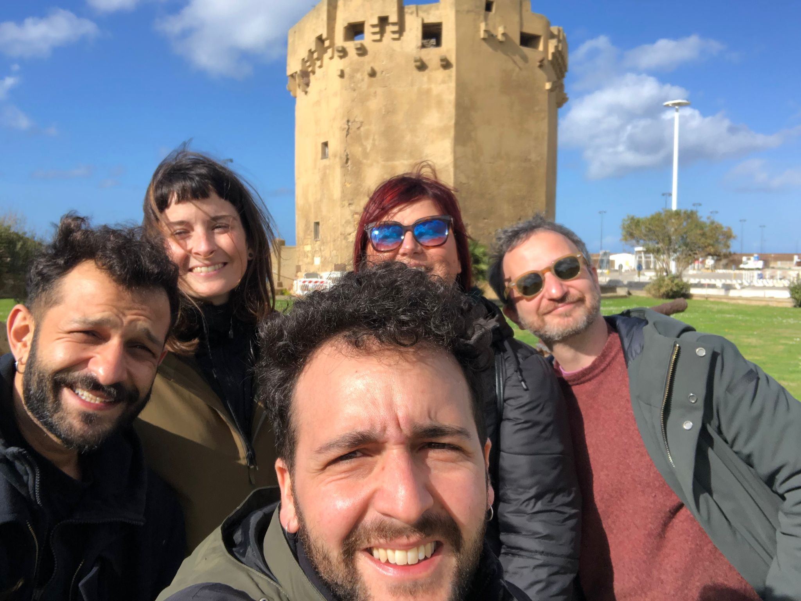

In February 2024, I had the opportunity to spend a month in beautiful Sardinia as a visiting researcher at the University of Sassari. It was a fantastic chance to meet incredible people, strengthen existing collaborations, and initiate new ones. I also had the pleasure of delivering an invited talk on my project, [VegTrends](https://mgsperandii.netlify.app/vegtrends/), where I presented the results I had gathered. Of course, it was also a time for unforgettable excursions, during which we fell in love with the island’s breathtaking landscapes and natural beauty.

Stay tuned for updates! :mega:

<a class="twitter-timeline" data-height="400" data-theme="dark" href="https://twitter.com/mgsperandii?ref_src=twsrc%5Etfw">Tweets by mgsperandii</a> 
