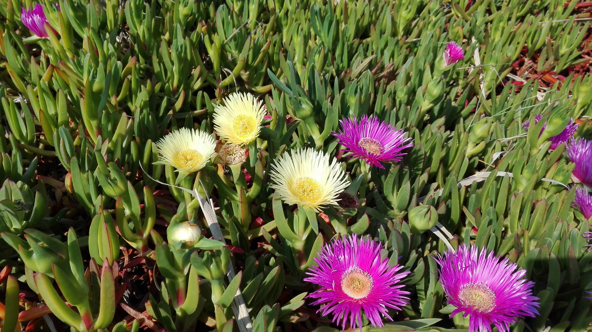
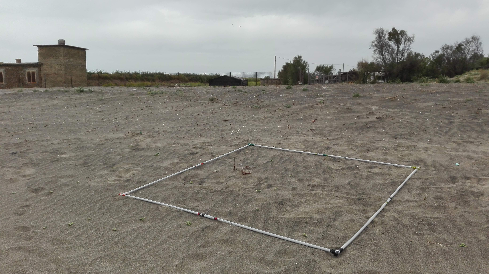
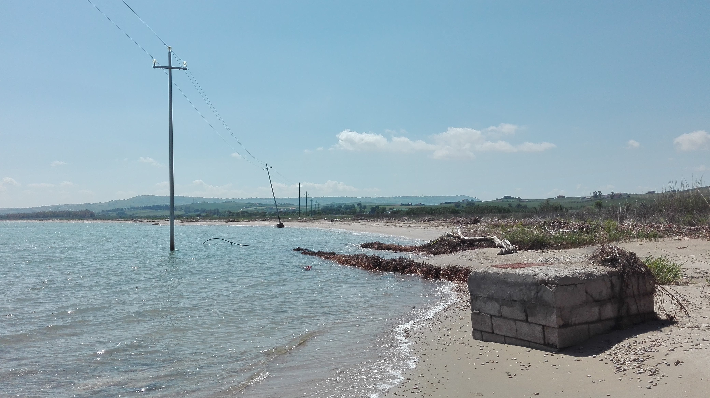

Coastal dunes are among the most interesting ecosystems on earth, yet they are currently exposed to many threats globally affecting their conservation status. In the Mediterranean, several  dune habitats [have been recently assessed as either endangered or vulnerable](https://op.europa.eu/en/publication-detail/-/publication/22542b64-c501-11e7-9b01-01aa75ed71a1/language-en), and their conservation status in Italy largely reflects the European picture. Identifying the most endangered habitats and monitoring their dynamics are key tasks that cannot be further procrastinated, if we want to avoid a complete disappearance of these ecosystems in the near future.

During my PhD, I used different approaches to quantify temporal changes characterizing Mediterranean coastal dune habitats in Central Italy.

I started by performing a [diachronic analysis of a large database of random, standardized, georeferenced plots](https://link.springer.com/article/10.1007/s10531-017-1454-1). Dune grasslands appeared as the most impacted habitat, with a negative trend in species richness and habitat cover. At the same time, results hinted at "early warnings" of degradation processes in shifting dunes, where a decline in the cover of the sand-binding _Ammophila arenaria_ subsp. _australis_, and a parallel increase in the cover of _Carpobrotus_ sp. were recorded.

During two field seasons (2017 and 2018), I performed a resurveying study on 334 historical plots belonging to herbaceous dune habitats. [A preliminary analysis of the data collected during my first sampling season](https://doi.org/10.1016/j.ecolind.2018.09.039) revealed important compositional shifts, mainly driven by species turnover and especially affecting upper beach and mobile dunes at both the community and species level.

After the second field season, I was able to [analyse the complete set of data and provide a comprehensive assessment of how Mediterranean coastal dune habitats of Central Italy changed in their taxonomic and functional diversity over a period of 10-15 years](https://doi.org/10.1111/1365-2745.13547). The results were alarming: almost one over four of the historical plots disappeared (i.e. was found to be unvegetated or submerged by the sea). Observed taxonomic and functional changes often exceeded “simulated changes”, especially in the first part of coastal zonation. Dramatic changes were especially observed in shifting dunes, which experienced considerable functional shifts, and where _Ammophila arenaria_ disappeared from about 80% of the historical plots in which it was originally recorded.

